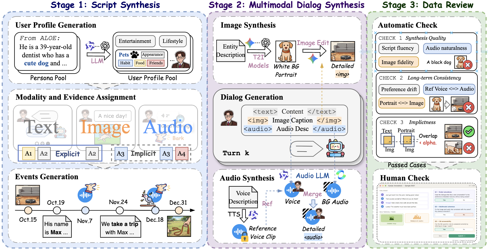

<h1 align="center">🧠 CUE-Mem: Benchmarking Long-Term User Memory<br>via Implicit Cues in Multimodal Conversations</h1>

<p align="center">
  <b>Long-Term Memory for Omni-Modal Agents</b>
</p>

<p align="center">
  Yulin Hu · Yanyan Zhao · Zimo Long · Xing Fu · Mengtong Ji<br>
  Weixiang Zhao · Yutai Hou · Qianchao Wang · Dandan Tu<br>
  <sub>Harbin Institute of Technology &nbsp; · &nbsp; Huawei Technologies Co., Ltd.</sub>
</p>

<p align="center">
  <a href="https://reichenbach1854-hash.github.io/CUE-Mem/"></a>
  <a href="https://huggingface.co/datasets/Kkryptonite/CUE-Mem"></a>
  <a href="#getting-started"></a>
  <a href="#citation"></a>
</p>

<p align="center">
  <a href="#overview">Overview</a> •
  <a href="#getting-started">Installation</a> •
  <a href="#experiments">Experiments</a> •
  <a href="#citation">Citation</a> •
  <a href="guides/usage_zh.md">中文指南</a>
</p>

**CUE-Mem** benchmarks long-term user memory in **omni-modal agents**, with 2,674 questions grounded in explicit and implicit cues across text, images, and audio.

<p align="center">
  <b>2,674 questions</b> &nbsp; · &nbsp; <b>Omni-modal: Text · Image · Audio</b> &nbsp; · &nbsp; <b>4 tasks</b> &nbsp; · &nbsp; <b>Explicit &amp; implicit evidence</b>
</p>

<p align="center">
  <a href="https://reichenbach1854-hash.github.io/CUE-Mem/"></a><br>
  <sub>CUE-Mem construction and evaluation. <a href="https://reichenbach1854-hash.github.io/CUE-Mem/">Explore image, audio, and QA examples in the interactive demo →</a></sub>
</p>

## Overview

CUE-Mem evaluates how agents retain and use user information from multimodal conversation histories. It compares explicit statements with implicit cues, such as objects in photographs and background sounds in audio, across four memory tasks.

| Task | What should the agent remember or infer? |
| :--- | :--- |
| 🧩 **Entity Recall** | User-related entities and their attributes |
| 🔎 **Long Pattern** | Persistent preferences and habits across interactions |
| 🎯 **Personalized Recommendation** | Information needed for a new recommendation |
| 🛑 **Answer Refusal** | Whether the history provides enough evidence to answer |

The repository includes **data-construction scripts**, **RQ1–RQ3 evaluation pipelines**, and **interactive demos**. The dataset is available on [Hugging Face](https://huggingface.co/datasets/Kkryptonite/CUE-Mem).

## Getting started

### 1. Browse the demo

Explore the [online demo](https://reichenbach1854-hash.github.io/CUE-Mem/), or run it locally:

```bash
git clone https://github.com/yulinlp/CUE-MEM.git
cd CUE-MEM
python -m http.server 8000 --bind 127.0.0.1 --directory docs
```

Open **http://127.0.0.1:8000**.

### 2. Install experiment dependencies

Use Python **3.10 or later**, and run commands from the repository root.

```bash
python -m venv .venv
source .venv/bin/activate
python -m pip install --upgrade pip
python -m pip install -r requirements-eval.txt
python -m pip install torch
```

For GPU experiments, install PyTorch for your CUDA version. Install the packages and weights for your chosen memory backend, ImageBind, or TTS service as needed.

### 3. Download and prepare the dataset

```bash
python -m pip install huggingface_hub
hf download Kkryptonite/CUE-Mem --repo-type dataset --local-dir benchmark-data

python -m scripts.prepare_dataset \
  --dataset-root benchmark-data \
  --output-root workdir/benchmark
```

The command prepares dialogue and QA files for the evaluation runners and links them to media in `benchmark-data/`. Keep that directory in place after preparation.

Download any missing media listed in `workdir/benchmark/dataset_preparation.json` before running multimodal experiments.

### 4. Configure your model service

```bash
cp .env.example .env
# Edit .env with the endpoint and credentials for your selected services.
set -a
source .env
set +a

export CUE_MEM_BENCHMARK_ROOT="$PWD/workdir/benchmark"
```

Set `CUE_MEM_LLM_API_KEY` and `CUE_MEM_LLM_BASE_URL` for RQ1/RQ2, and choose a model served by your endpoint from the runner’s `--help` list. For RQ3, configure `RQ3_OMNI_*` and your embedding provider in [`.env.example`](.env.example).

## Experiments

### RQ1: Memory from explicit and implicit evidence

Evaluate one profile with your configured model service:

```bash
python -m scripts.RQ1_RQ2.benchmark.run.run_bench \
  --llm_name qwen3.6-35b-a3b \
  --memory_name FUMemory \
  --data_name history_with_qa_p0 \
  --caption_category base \
  --sample 1 \
  --save_results
```

`--sample` sets the number of QA items per category. Memory backends process the conversation history separately. With `--caption_category base`, `--data_name` selects a JSON file under `data/dialog/base/`, without the `.json` extension.

Question-only and oracle-evidence baselines have separate entry points:

```bash
python -m scripts.RQ1_RQ2.benchmark.run.run_bench_question_only --help
python -m scripts.RQ1_RQ2.benchmark.run.run_bench_oracle_evidence --help
```

### RQ2: What is preserved by textualization?

RQ2 compares image-caption detail and audio representations. Prepare the caption variants, then run memory evaluation:

```bash
python -m scripts.RQ1_RQ2.benchmark.run.run_bench --help
python -m scripts.qa.build_bench_input --help
python -m scripts.qa.build_audio_caption_study_inputs --help
```

Use the runner's `--caption_category` and `--audio_caption` options for prepared variants. Summarize existing results with:

```bash
python -m scripts.RQ1_RQ2.benchmark.run.aggregate_results \
  --mode overall \
  --result-dir "$CUE_MEM_BENCHMARK_ROOT/result_debug/base"
```

The [detailed guide](guides/usage_zh.md#7-rq1rq2-benchmark) covers caption/audio comparisons, memory backends, and Slurm wrappers.

### RQ3: Retrieval and evidence use in Omni models

RQ3 evaluates how **Omni models** use retrieved user memories, separating the retrieval index from the evidence supplied to the answering model. Its four settings isolate the contributions of multimodal retrieval and omni-modal evidence use:

| Variant | Index | Evidence use |
|---|---|---|
| `TT` | Text | Text |
| `TM` | Text | Multimodal |
| `MT` | Multimodal | Text |
| `MM` | Multimodal | Multimodal |

Point RQ3 to the prepared histories and the downloaded media:

```bash
export RQ3_HISTORY_DIR="$PWD/workdir/benchmark/data/dialog/base"
export RQ3_DATA_DIR="$PWD/benchmark-data"
export CUE_MEM_RQ3_ROOT="$PWD/workdir/RQ3"
```

After installing ImageBind and its checkpoint, generate the indices needed for the selected variants:

```bash
python -m scripts.RQ3.step1_encode_embeddings \
  --embedding-provider imagebind \
  --profiles 0 \
  --modes text unified_multimodal \
  --skip-existing

python -m scripts.RQ3.step2_run_experiment \
  --variants TT TM MT MM \
  --profiles 0 \
  --sample 10 \
  --max-workers 1

python -m scripts.RQ3.step3_evaluate \
  --result-root workdir/RQ3/results
```

The experiment stage requires an Omni answering service configured through `RQ3_OMNI_*`. A Gemini-compatible embedding backend is also supported; see the [detailed guide](guides/usage_zh.md#8-rq3-实验).

## Data construction and human evaluation

The data-construction pipeline follows **profiles → events and conversations → QA → benchmark inputs**.

| Directory | Contents |
|---|---|
| `scripts/profile/` | Profiles, entity anchors, portraits, and voice design |
| `scripts/event/` | Event plans, conversations, images, and audio |
| `scripts/qa/` | Question construction, checks, and input conversion |
| `scripts/RQ1_RQ2/` | Textualized memory methods, baselines, and aggregation |
| `scripts/RQ3/` | Embedding, retrieval, Omni answering, and evaluation |
| `scripts/human_baseline_demo/` | Interactive annotation interface |
| `scripts/common/` | Shared configuration, paths, and I/O |
| `docs/` | Static website and selected demo media |

To collect human answers using a prepared profile:

```bash
python -m scripts.human_baseline_demo \
  --data workdir/benchmark/data/dialog/base/history_with_qa_p0.json \
  --media-root benchmark-data \
  --output-dir workdir/human-results \
  --host 127.0.0.1 --port 8765
```

Open http://127.0.0.1:8765. Participant submissions are saved to `workdir/human-results/`.

[Validation results](guides/validation.md)

## Citation

```bibtex
@misc{hu2026cuemem,
  title = {CUE-Mem: Benchmarking Long-Term User Memory via Implicit Cues in Multimodal Conversations},
  author = {Hu, Yulin and Zhao, Yanyan and Long, Zimo and Fu, Xing and Ji, Mengtong and Zhao, Weixiang and Hou, Yutai and Wang, Qianchao and Tu, Dandan},
  year = {2026},
  url = {https://github.com/yulinlp/CUE-MEM}
}
```

## Acknowledgments and reuse

Thanks to our collaborators for the [original implementation and demo](https://github.com/reichenbach1854-hash/CUE-Mem), and to the authors of the memory systems and model backends used in our experiments.

Dataset terms are available on [Hugging Face](https://huggingface.co/datasets/Kkryptonite/CUE-Mem).
